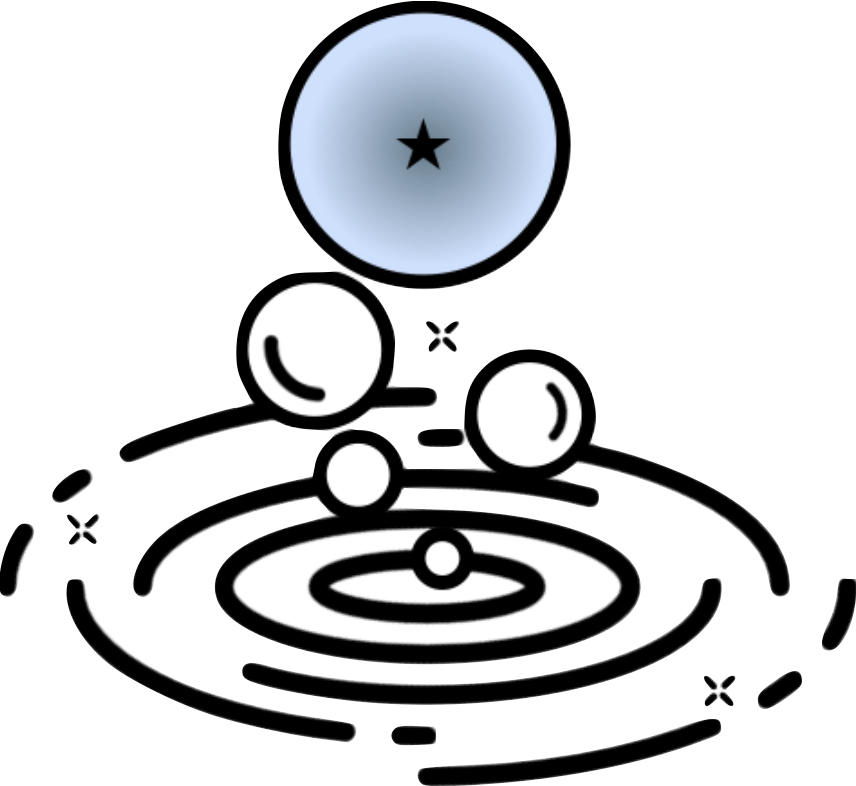

<p align="center">
  
</p>

# froth: Superbubble Identification with Graph Neural Networks

---

[](https://opensource.org/licenses/MIT)
[](https://www.python.org/downloads/)

---

Identify supernova-driven bubbles or general underdense regions in simulation snapshots or galaxy images using trained graph neural networks. The models can take either gas data or image intensity as input features. Currently validated on high-resolution Arepo galaxy simulations with spatial resolutions of 10, 30, and 100 pc, as well as JWST galaxy images in the F770W and F1130W bands.

This package is implements the method described in the paper:

*Coming soon.*

---

## Currently Available Models

| Model | Type | Input | Features |
|-------|------|-------|----------|
| `aerate_3D` | 3D | simulation snapshot | gas density & temperature |
| `aerate_3D_den` | 3D | simulation snapshot | gas density |
| `aerate_3D_hot` | 3D | simulation snapshot | gas density & temperature, </br>hard negatives for T < 10<sup>5.5</sup> K |
| `aerate_2D_den` | 2D | galaxy image | column density / intensity |

<!-- | `aerate_2D` | 2D | projected maps | gas density & temperature | -->

---

## Installation

### Install from PyPI

*Coming soon.*

### Install from source:

```bash
git clone https://github.com/sytan177/froth.git
cd froth
pip install -e . 
```

## Requirements
- Python 3.9+

### Core Dependencies
- numpy
- torch
- torch-geometric
- scikit-learn
- h5py
- numba
- joblib

### Optional - for galaxy image preprocessing
- photutils
- torch-sparse
- torch-scatter

## Quick Start


See [`examples/getting_started.ipynb`](examples/getting_started.ipynb) for a practical walkthrough covering simulation snapshots and observational images.

```python
from froth import SnapData, ImageData, SnapConfig, ImageConfig, BubbleClassifier, BubbleExtractor

# simulation snapshot
snap = SnapData(snapshot_data, config_file='config.yaml')
classifier = BubbleClassifier(model_name='aerate_3d')
classifier.aerate_snapshot(snap)

extractor = BubbleExtractor(snap)
extractor.knock_snapshot()

# observational image
image = ImageData('path_to_file.fits')
classifier = BubbleClassifier('aerate_2d_den')
classifier.aerate_image(image)
extractor = BubbleExtractor(image)
extractor.knock_image()
```

